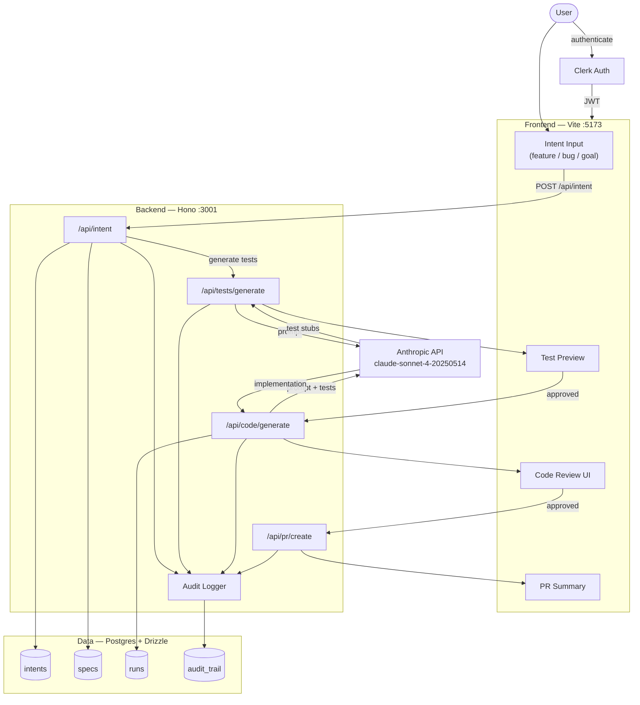

# FlowState S1 — Architecture

## The Core Loop

```
Intent → Tests → Code → Reviewed PR
```

## System Diagram



## Data Flow Narrative

1. **Intent** — User describes what they want. Stored in `intents`, converted to a spec.
2. **Tests** — Backend prompts Claude with the spec. Generated test stubs shown to user for approval before any code is written.
3. **Code** — Backend prompts Claude with spec + approved tests. Implementation shown to user for review.
4. **Reviewed PR** — Approved code bundled into a PR summary with full audit trail attached.

Every AI call writes to `audit_trail` before the result is surfaced — no AI action is invisible.

## Auth Boundary

All `/api/*` routes require a valid Clerk JWT. The frontend attaches the token; the backend validates it before any handler runs.

## Port Reference

| Service        | Port |
|----------------|------|
| Frontend (Vite)| 5173 |
| Backend (Hono) | 3001 |
| Postgres       | 5432 |
